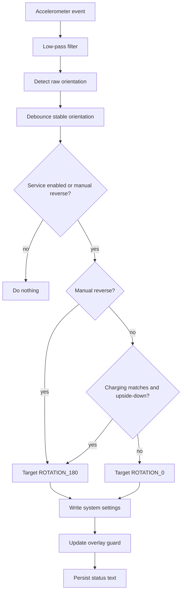

# UpsideCharge Developer Notes

> A deliberately nerdy map of how this app works, why it needs odd permissions, and where to tune it when Samsung or Android changes the rules.

## Table of Contents

- [System Model](#system-model)
- [Project Layout](#project-layout)
- [Runtime Architecture](#runtime-architecture)
- [Rotation Pipeline](#rotation-pipeline)
- [Sensor Logic](#sensor-logic)
- [Global Orientation Guard](#global-orientation-guard)
- [Permissions](#permissions)
- [ADB Cookbook](#adb-cookbook)
- [State Machine](#state-machine)
- [Tuning Constants](#tuning-constants)
- [Troubleshooting](#troubleshooting)
- [Known Limits](#known-limits)
- [Glossary](#glossary)

## System Model

UpsideCharge is not trying to rotate only its own `Activity`.

The target behavior is display-level reverse portrait:

```text
phone physically upside down
        +
charging condition matches
        +
foreground service active
        |
        v
system rotation locked to Surface.ROTATION_180
        +
overlay guard requests SCREEN_ORIENTATION_REVERSE_PORTRAIT
```

The app intentionally avoids landscape. It only writes:

| Desired state | `accelerometer_rotation` | `user_rotation` |
| --- | ---: | ---: |
| Normal portrait | `0` | `0` |
| Reverse portrait | `0` | `2` |

`Surface.ROTATION_180 == 2`.

## Project Layout

```text
.
├── app/
│   ├── build.gradle.kts
│   └── src/main/
│       ├── AndroidManifest.xml
│       ├── java/com/niko/upsidecharge/
│       │   ├── MainActivity.kt
│       │   ├── Prefs.kt
│       │   ├── RotationController.kt
│       │   ├── RotationOverlayGuard.kt
│       │   ├── ServiceStarterReceiver.kt
│       │   └── UpsideChargeService.kt
│       └── res/
│           ├── values/
│           └── values-night/
├── build.gradle.kts
├── settings.gradle.kts
├── README.md
└── DEVELOPER.md
```

## Runtime Architecture

### `MainActivity`

Native Android view UI, built programmatically.

Responsibilities:

- Show toggles and status.
- Open permission screens.
- Start and stop `UpsideChargeService`.
- Persist user intent in `SharedPreferences`.

Key controls:

- `Enable UpsideCharge`
- `Any charging source`
- `Invert sensor direction`
- `Grant Modify System Settings`
- `Grant Appear on Top`
- `Turn Around Now`
- `Restore Normal`

### `UpsideChargeService`

Foreground service. This is the actual engine.

Responsibilities:

- Read charging state.
- Listen to accelerometer.
- Filter sensor noise.
- Decide target rotation.
- Write Android system rotation settings.
- Keep an overlay orientation guard active.
- Keep status values in prefs for the UI.

### `RotationController`

Small settings wrapper around:

- `Settings.System.ACCELEROMETER_ROTATION`
- `Settings.System.USER_ROTATION`
- `Settings.System.canWrite(context)`

It also saves the previous settings before the first write and restores them when the service is actually disabled.

### `RotationOverlayGuard`

Creates a 1x1 non-touchable overlay window:

```kotlin
WindowManager.LayoutParams.TYPE_APPLICATION_OVERLAY
WindowManager.LayoutParams.FLAG_NOT_FOCUSABLE
WindowManager.LayoutParams.FLAG_NOT_TOUCHABLE
screenOrientation = SCREEN_ORIENTATION_REVERSE_PORTRAIT
```

Why this exists:

- Writing `USER_ROTATION=2` is not always enough.
- Other apps can request their own orientation.
- Samsung/Android may reset display rotation when task focus changes.
- A top-level overlay can become WindowManager's orientation source.

### `ServiceStarterReceiver`

Restarts the service when:

- The app package is replaced.
- The phone boots.

Only starts the service if the saved prefs say it should run.

## Rotation Pipeline



If the service is active and Android tries to reset rotation, the service reasserts reverse portrait every `ROTATION_REASSERT_MS` while reverse mode is desired.

## Sensor Logic

The accelerometer gives gravity-ish values:

```text
x = left/right tilt
y = top/bottom portrait axis
z = face-up/face-down flatness
```

The service low-pass filters the stream:

```kotlin
filtered += FILTER_ALPHA * (raw - filtered)
```

Then portrait is accepted only if:

```text
abs(y) >= PORTRAIT_ENTER_THRESHOLD
abs(y) > abs(x) + AXIS_DOMINANCE_MARGIN
abs(z) <= MAX_VERTICAL_Z
```

This means:

- `y` must be strong enough.
- `y` must dominate `x`, so landscape-ish poses are rejected.
- `z` cannot look too flat, so lying on a table does not count.

Upside-down is currently:

```kotlin
y <= -PORTRAIT_ENTER_THRESHOLD
```

unless `Invert sensor direction` is enabled.

## Global Orientation Guard

The service uses two layers:

1. System rotation lock:

   ```text
   accelerometer_rotation = 0
   user_rotation = 2
   ```

2. Overlay orientation source:

   ```text
   SCREEN_ORIENTATION_REVERSE_PORTRAIT
   ```

Verification command:

```powershell
adb shell dumpsys window | Select-String -Pattern 'UpsideChargeRotationGuard|mDisplayRotation=ROTATION|deepestLastOrientationSource'
```

Expected output contains:

```text
deepestLastOrientationSource=Window{... UpsideChargeRotationGuard}
mDisplayRotation=ROTATION_180
mRotation=ROTATION_180
```

## Permissions

### Manifest Permissions

| Permission | Why |
| --- | --- |
| `WRITE_SETTINGS` | Write `accelerometer_rotation` and `user_rotation`. |
| `SYSTEM_ALERT_WINDOW` | Add the invisible orientation overlay guard. |
| `FOREGROUND_SERVICE` | Run the sensor service outside the activity. |
| `FOREGROUND_SERVICE_SPECIAL_USE` | Required for special-use foreground service type on newer Android. |
| `POST_NOTIFICATIONS` | Show foreground service notification on Android 13+. |
| `WAKE_LOCK` | Reserved for service stability if needed. |
| `RECEIVE_BOOT_COMPLETED` | Restore service after reboot if enabled. |
| `REQUEST_IGNORE_BATTERY_OPTIMIZATIONS` | Allow asking/whitelisting against Doze throttling. |

### ADB Grants

```powershell
adb shell appops set com.niko.upsidecharge android:write_settings allow
adb shell appops set com.niko.upsidecharge SYSTEM_ALERT_WINDOW allow
adb shell pm grant com.niko.upsidecharge android.permission.POST_NOTIFICATIONS
adb shell dumpsys deviceidle whitelist +com.niko.upsidecharge
```

## ADB Cookbook

### Build

```powershell
gradle :app:assembleDebug
```

### Install

```powershell
adb install -r app\build\outputs\apk\debug\app-debug.apk
```

### Wireless Debugging

Find advertised wireless debugging ports:

```powershell
adb mdns services
```

Connect:

```powershell
adb connect PHONE_IP:ADB_PORT
```

Use a specific device:

```powershell
adb -s PHONE_IP:ADB_PORT shell am start -n com.niko.upsidecharge/.MainActivity
```

### Inspect App State

```powershell
adb shell run-as com.niko.upsidecharge cat shared_prefs/upside_charge.xml
```

Interesting values:

```xml
<boolean name="enabled" value="true" />
<boolean name="service_running" value="true" />
<string name="orientation_status">Upside-down portrait</string>
<string name="action_status">Reverse portrait active</string>
<string name="sensor_status">x=0.1 y=-9.2 z=3.4</string>
```

### Inspect Rotation Settings

```powershell
adb shell settings get system accelerometer_rotation
adb shell settings get system user_rotation
```

Expected reverse portrait:

```text
0
2
```

### Manual Rotation Test

```powershell
adb shell settings put system accelerometer_rotation 0
adb shell settings put system user_rotation 2
adb shell settings put system user_rotation 0
adb shell settings put system accelerometer_rotation 1
```

### Inspect Service

```powershell
adb shell dumpsys activity services com.niko.upsidecharge
```

Look for:

```text
UpsideChargeService
isForeground=true
startRequested=true
```

### Inspect Overlay Guard

```powershell
adb shell dumpsys window | Select-String -Pattern 'UpsideChargeRotationGuard|SCREEN_ORIENTATION_REVERSE_PORTRAIT|mDisplayRotation'
```

## State Machine

```text
Disabled
  |
  | Enable UpsideCharge
  v
Waiting
  |
  | charging matches + stable upside-down portrait
  v
Reverse portrait active
  |
  | unplugged / normal portrait / other pose
  v
Waiting or Normal
```

Manual flow:

```text
Turn Around Now
  -> manual_reverse=true
  -> service starts if needed
  -> ROTATION_180
  -> overlay guard active

Restore Normal
  -> manual_reverse=false
  -> ROTATION_0
  -> overlay guard removed
```

## Tuning Constants

In `UpsideChargeService.kt`:

| Constant | Current | Meaning |
| --- | ---: | --- |
| `FILTER_ALPHA` | `0.22f` | Low-pass filter strength. Higher = faster, noisier. |
| `ORIENTATION_STABLE_MS` | `650L` | Debounce window before accepting orientation change. |
| `PORTRAIT_ENTER_THRESHOLD` | `6.8f` | Required portrait-axis gravity strength. |
| `AXIS_DOMINANCE_MARGIN` | `1.2f` | How much stronger Y must be than X. |
| `MAX_VERTICAL_Z` | `6.8f` | Rejects flatter positions. |
| `ROTATION_REASSERT_MS` | `1200L` | Minimum interval before re-writing reverse rotation. |

### Sensor Examples

Flat on table:

```text
x=0.3 y=0.1 z=9.9 -> Other
```

Vertical upside down:

```text
x=0.1 y=-9.2 z=3.4 -> Upside-down portrait
```

Vertical normal:

```text
x=0.2 y=9.0 z=3.0 -> Normal portrait
```

If those last two are swapped, enable **Invert sensor direction**.

## Troubleshooting

### It Works Only Inside The App

Check overlay permission:

```powershell
adb shell appops get com.niko.upsidecharge SYSTEM_ALERT_WINDOW
```

Expected:

```text
SYSTEM_ALERT_WINDOW: allow
```

Check WindowManager:

```powershell
adb shell dumpsys window | Select-String -Pattern 'UpsideChargeRotationGuard|deepestLastOrientationSource'
```

Expected:

```text
deepestLastOrientationSource=Window{... UpsideChargeRotationGuard}
```

### Rotation Keeps Returning To Normal

Check whether Android settings are being rewritten:

```powershell
adb shell settings get system accelerometer_rotation
adb shell settings get system user_rotation
```

Reverse portrait should be:

```text
0
2
```

If settings are correct but apps still look normal, inspect the overlay guard.

### The Phone Is Upside Down But Status Says `Other`

Read the sensor row in the app or via:

```powershell
adb shell run-as com.niko.upsidecharge cat shared_prefs/upside_charge.xml
```

If `z` is high, the phone is too flat. If `x` is close to `y`, the phone is too diagonal/landscape-ish.

### Wireless ADB Port Changed

This is normal. Wireless debugging ports are not stable.

Find the new port:

```powershell
adb mdns services
```

Reconnect:

```powershell
adb connect PHONE_IP:NEW_PORT
```

### Service Dies In Background

Check:

```powershell
adb shell dumpsys activity services com.niko.upsidecharge
```

Whitelist:

```powershell
adb shell dumpsys deviceidle whitelist +com.niko.upsidecharge
```

Samsung may still apply vendor-specific battery policy. If needed, manually set the app to unrestricted battery usage in Android settings.

## Known Limits

- This is a non-root app. It cannot force every possible app or system surface in every possible state.
- Some apps can request fixed orientation aggressively.
- Secure screens, lock screen, camera, games, and full-screen media may have their own policies.
- Wireless debugging ports change; IP reservation helps only with the IP, not the port.
- Overlay permission is sensitive. Android may revoke or warn about it.

## Glossary

| Term | Meaning |
| --- | --- |
| Reverse portrait | Portrait layout rotated 180 degrees. |
| `USER_ROTATION` | Android setting for locked user rotation. |
| `ACCELEROMETER_ROTATION` | Android setting for auto-rotate on/off. |
| Overlay guard | Invisible `TYPE_APPLICATION_OVERLAY` window that requests reverse portrait. |
| Foreground service | Long-running service with a persistent notification. |
| App-op | Android operation-level permission controlled by `appops`. |
| Doze | Android power-saving mode that can throttle background work. |

## Quick Sanity Checklist

- [ ] APK builds.
- [ ] `WRITE_SETTINGS` is allowed.
- [ ] `SYSTEM_ALERT_WINDOW` is allowed.
- [ ] Foreground service is running.
- [ ] `user_rotation=2` when reverse is active.
- [ ] `UpsideChargeRotationGuard` appears in `dumpsys window`.
- [ ] Launcher remains `ROTATION_180` after pressing Home.

## Final Mental Model

```text
Settings.System controls the base rotation lock.
WindowManager overlay makes reverse portrait win outside the app.
Foreground service keeps both alive.
Prefs keep the UI and service loosely synchronized.
ADB is the fast path for permissions and verification.
```
